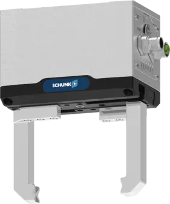
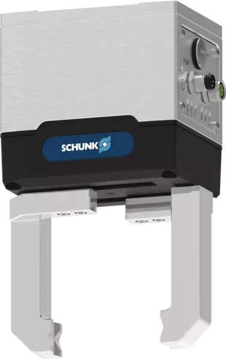
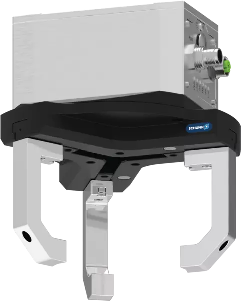

<p align="center">
  
  &nbsp;&nbsp;&nbsp;&nbsp;&nbsp;&nbsp;&nbsp;&nbsp;&nbsp;&nbsp;&nbsp;
  
  &nbsp;&nbsp;&nbsp;&nbsp;&nbsp;&nbsp;&nbsp;&nbsp;&nbsp;&nbsp;&nbsp;
  
</p>

<p align="center">
  <a href="https://opensource.org/licenses/gpl-license">
    
  </a>
  <a href="https://github.com/SCHUNK-SE-Co-KG/schunk_egu_egk_gripper/actions">
    
  </a>
  <a href="https://github.com/SCHUNK-SE-Co-KG/schunk_egu_egk_gripper/actions">
    
  </a>
</p>


The **SCHUNK Gripper ROS2 Driver** provides full functionality for controlling SCHUNK's mechatronic grippers:

- [EGU](https://schunk.com/us/en/gripping-systems/parallel-gripper/egu/c/PGR_6556) – universal gripper
- [EGK](https://schunk.com/us/en/gripping-systems/parallel-gripper/egk/c/PGR_6557) – gripper for small components
- [EZU](https://schunk.com/us/en/gripping-systems/centric-grippers/ezu/c/PGR_7387) – centric gripper

Currently, the driver supports only grippers with **Modbus RTU** or **Ethernet/IP** interfaces.


## Overview

The SCHUNK Gripper ROS2 driver provides an interface to control SCHUNK mechatronic grippers over either **Modbus RTU** or **Ethernet/IP**.
The driver architecture consists of:

- **Gripper Library** – handles low-level communication and abstracts the protocol details for each gripper variant.
- **ROS2 Node** – exposes topics and services to read the gripper state and send commands.
- **Interfaces** - a collection of message and service defintions to interact with the grippers.

The driver can **automatically detect connected grippers** and supports **handling multiple grippers simultaneously** within a single ROS2 node, with each gripper running in a separate ROS2 namespace.

### Lifecycle Management

The driver node follows the standard [ROS2 lifecycle](https://design.ros2.org/articles/node_lifecycle.html) conventions. All grippers managed by a single driver node share the **same lifecycle state** — `unconfigured`, `inactive`, `active`, and `finalized`.
The driver does **not** perform state transitions automatically; all transitions must be triggered via service calls from an external client.
Services and published topics are **bound to the lifecycle state** and are only available when the driver (and all connected grippers) is in the appropriate state. For example, grip commands can only be issued when the node is in the `active` state.


## Topics and Services

The driver exposes topics and services to retrieve the gripper state and parameters, and to issue commands such as gripping, moving, jogging, releasing etc.
All topics and services are namespaced per gripper and are advertised only when the driver is in the appropriate lifecycle state (e.g., `active`).


## Connecting to Grippers

The driver starts in the `unconfigured` lifecycle state. In this state, it provides services to scan the network for available grippers and to add them to the driver.
<br>
Once the driver has transitioned into the `active` lifecycle state, each added gripper can be accessed and controlled through its assigned namespace.

It is also possible to locate connected grippers by triggering a twitch of their fingers via a service call. This feature is useful in scenarios where you need to identify which physical gripper corresponds to which connection.

### Auto-Connect

Grippers that have been added to the driver can be saved to a configuration file via a service call. This configuration file can be loaded either via a service call or a launch argument, allowing the driver to automatically connect to all previously saved grippers. If a saved gripper is not physically available at runtime, its corresponding services will still be published, but calling them will result in no-ops.


## Installation

1. Clone the repository into your ROS2 workspace and install system dependencies:
    ```bash
    cd ~/ros2_ws/src
    git clone https://github.com/SCHUNK-SE-Co-KG/schunk_mechatronic_gripper.git schunk_gripper
    cd ..
    sudo apt update -qq
    rosdep update
    rosdep install --from-paths src --ignore-src -y
    ```

2. (Optional) Create and activate a Python virtual environment for the library dependencies:
    ```bash
    python3 -m venv .venv
    source .venv/bin/activate
    ```

3. Install the Python library dependencies:
    ```bash
    cd src/schunk_gripper/schunk_gripper_library
    pip install -e .
    ```

4. Build the workspace:
    ```bash
    cd ~/ros2_ws
    colcon build
    ```

5. If `colcon build` fails due to missing Python packages, install them manually:
    ```bash
    pip install empy catkin_pkg lark
    ```


## Launching the Driver

If you installed the Python dependencies in a virtual environment, activate it first:
```bash
source .venv/bin/activate
```

Then launch the driver:
```bash
ros2 launch schunk_gripper_driver driver.launch.py
```

### Launch Options

- **No arguments:**
  Starts the driver with an empty configuration. The driver remains in the `unconfigured` state, allowing you to scan the network and add grippers individually using the provided services.

- **Specify Ethernet/IP or Modbus address:**
  Pass connection parameters via launch arguments to immediately connect to specific grippers on startup.

- **Headless mode:**
  Enable headless mode via a launch argument to load all previously saved grippers from the configuration file and automatically transition them to the `active` lifecycle state.


## Contributing

Contributions to the SCHUNK Gripper ROS2 driver are welcome!

- Please fork the repository and create a feature branch from the `develop` branch.
- Follow the existing **coding style** and structure.
- Write **clear commit messages** describing your changes.
- Ensure all new functionality includes tests where applicable.
- Open a **pull request** against the `develop` branch and describe your changes in detail.

For major changes or new features, it’s recommended to **open an issue first** to discuss your proposal with the maintainers.


## License

This project is licensed under the **GPLv3 License**. See the [LICENSE](LICENSE) file for details.
